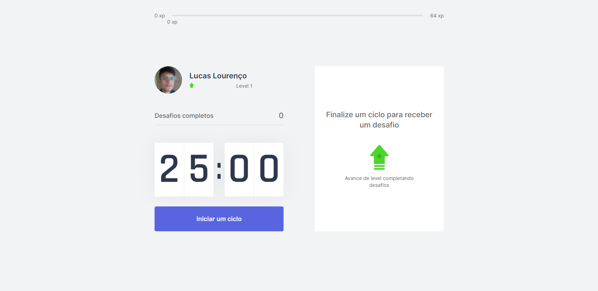
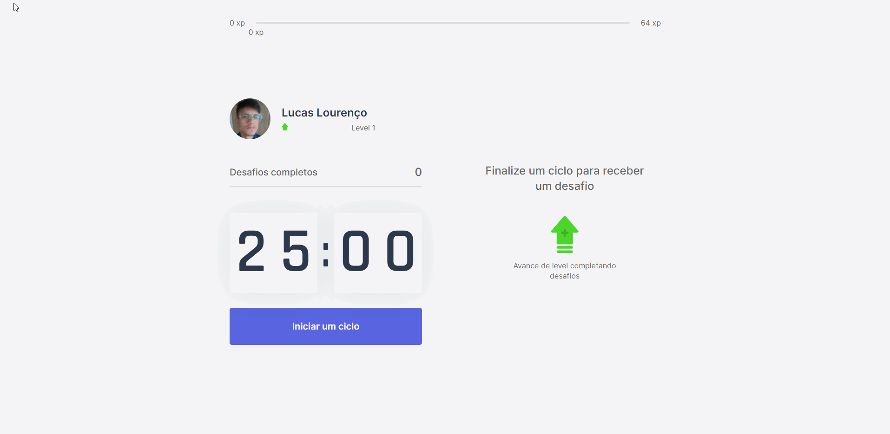
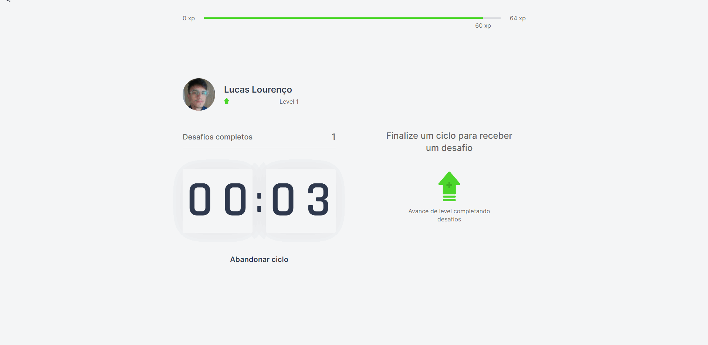

<h1 align="center">Projeto MoveIt</h1>

    Projeto baseado na técnica pomodoro, onde ao finalizar o cronômetro terá um desafio à ser realizado. Se caso o usuário realizar o desafio, conseguirá adquirir experiência e subir de nível. 

    Existe variados tipos de desafios a serem realizados.

 
 

<h2 align="center">Página principal</h2>

 
 

<h2 align="center">Funcionamento do Cronômetro</h2>

 
 

<h2 align="center">Desafio e LevelUp</h2>

 
 

<h2 align="center">Tecnologias usadas</h2>

- HTML ✔
- CSS ✔
- JavaScript ✔
- TypeScript ✔
- ReactJs ✔
- NextJs ✔
- Yarn ✔
- Armazenamento em cookies
